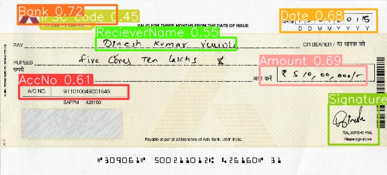
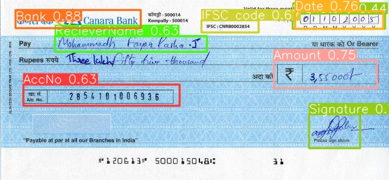

# 📁 Cheque Detection using YOLOv8

In this project, I've implemented cheque detection using the YOLOv8 model. To train and evaluate the model, I have created a custom dataset consisting of 216 images of cheques, which have been manually annotated and labeled by myself using the Roboflow platform. The dataset is divided into three subsets as follows:
1. **Training Set**: 182 images
2. **Validation Set**: 23 images
3. **Test Set**: 11 images

## Project Overview
The goal of this project is to detect the authenticity of cheques in images using the YOLOv8 object detection model. The project includes:
- A custom dataset of cheque images.
- Pre-trained YOLOv8 models.
- Scripts for running inference on new images and videos.
- Scripts for training the model on the custom dataset.

## Prediction



## Installation
To run this project, you need to have Python 3.7+ and `pip` installed. Follow the steps below to set up the environment:

1. Clone the repository:
    ```sh
    git clone https://github.com/prabhleenn/Cheque-Detection.git
    cd Cheque-Detection
    ```


2. Install the required dependencies:
    ```sh
    pip install "https://github.com/ultralytics/ultralytics/blob/main/pyproject.toml"
    ```
    
### Running Inference
To run inference on images using the pre-trained (.pt) model, use the following commands:

- On an image:
    ```sh
    python detect.py --source path/to/your/image.jpg --weights path/to/yolov8/weights.pt
    ```

### Training 🔍
To train the model on the custom cheque dataset, follow these steps:

1. Ensure your dataset is in the YOLO format:

      dataset/                          <br>
    ├── images/                         <br>
    │   ├── train/                      <br>
    │   │   ├── image1.jpg              <br>
    │   │   ├── image2.jpg              <br>
    │   │   └── ...                     <br>
    │   ├── val/                        <br>
    │   │   ├── image1.jpg              <br>
    │   │   └── ...                     <br>
    │   └── test/                       <br>
    │       ├── image1.jpg              <br>
    │       └── ...                     <br>
    └── labels/                         <br>
        ├── train/                      <br>
        │   ├── image1.txt              <br>
        │   ├── image2.txt              <br>
        │   └── ...                     <br>
        ├── val/                        <br>
        │   ├── image1.txt              <br>
        │   └── ...                     <br>
        └── test/                       <br>
            ├── image1.txt              <br>
            └── ...                     <br>

2. Update the yaml file with your dataset paths and parameters.
3. Run the training script:
    ```sh
    python train.py --data path/to/your/data.yaml --cfg path/to/yolov8/config.yaml --weights path/to/yolov8/weights.pt
    ```
    
